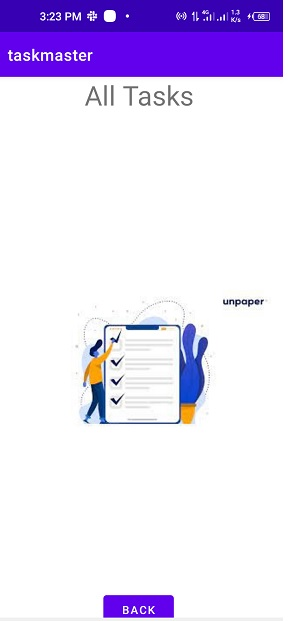
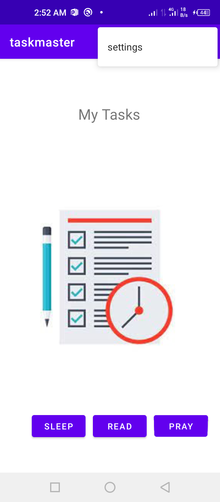

# taskmaster
* the task master app has three pages:
    * Main page (My Tasks contains: title "My Task", picture, 2 buttons(add task, all tasks))
      
      
    * add Task page (contains title, and some data to write: task title and description, button to submit and  text: total tasks)
      
      
    * all tasks page (contains title, image and back button)
      
      
------------------------------------------------------------

# Lab 27 

