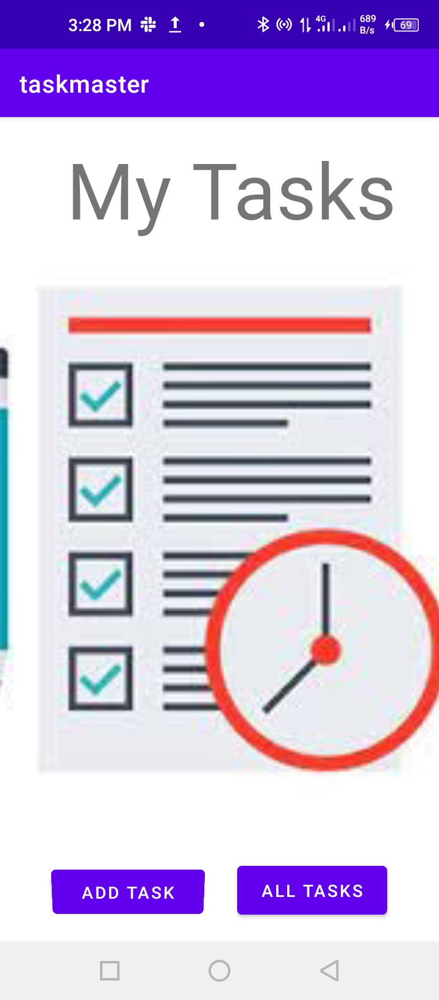
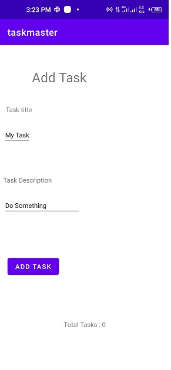
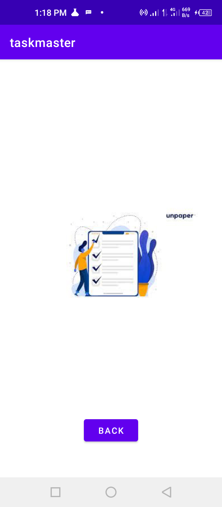
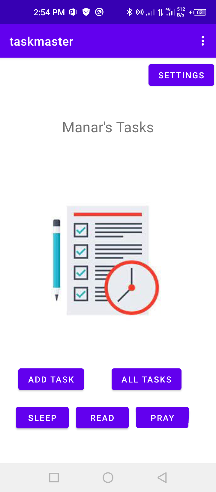
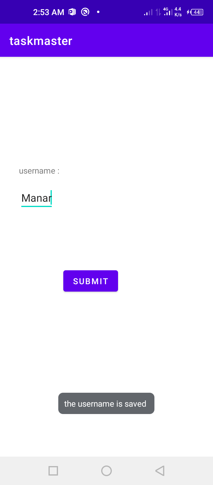
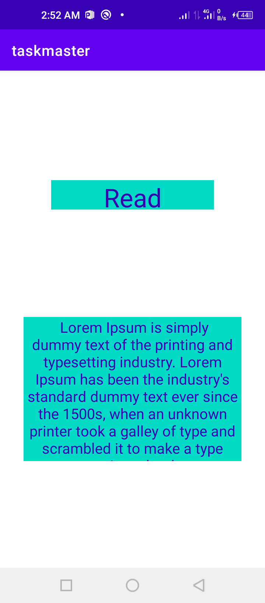

# taskmaster
* the task master app has three pages:
* Main page (My Tasks contains: title "My Task", picture, 2 buttons(add task, all tasks))
     
     
     

      

* add Task page (contains title, and some data to write: task title and description, button to submit and  text: total tasks)
     
     

     

      
* all tasks page (contains image and back button)
      

-----------------------------------------------------
# Lab 27

* settings button added 
* username appears on the main page

-------------------------------------------------------

